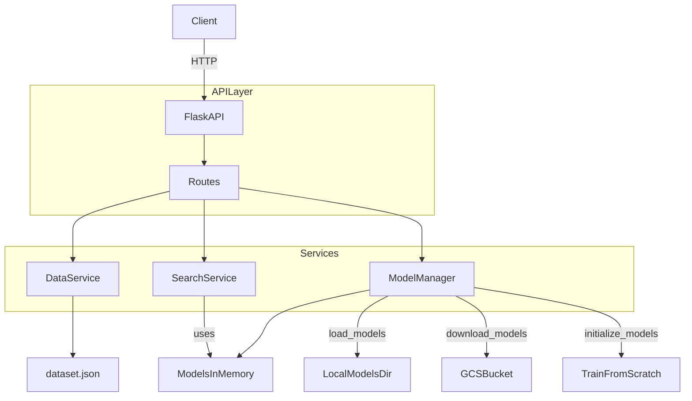

## Franchise Semantic Search (GCS + Local fallback)

This project is a Flask API that supports **hybrid search** (semantic + keyword) over franchise listings.

Key tech:
- **Universal Sentence Encoder (USE)** for embeddings
- **FAISS** for semantic similarity search
- **TF‑IDF** for keyword matching
- Optional model persistence via **Google Cloud Storage (GCS)**

### Architecture (high level)



## Project structure

Important paths:
- `DEOPLOYMENT/backend/main.py`: Flask app entrypoint
- `DEOPLOYMENT/backend/src/api/routes.py`: API endpoints
- `DEOPLOYMENT/backend/src/models/model_manager.py`: model load/train/save logic
- `DEOPLOYMENT/backend/src/services/data_service.py`: dataset load + add/update/delete + persistence
- `DEOPLOYMENT/dataset.json`: franchise listings
- `DEOPLOYMENT/models/`: model artifacts (tfidf/faiss/metadata)

## Running locally

From `DEOPLOYMENT/backend/`:

```bash
python -m pip install -r requirements.txt
python main.py
```

API will be on `http://localhost:8080`.

## Model load lifecycle (required behavior)

On startup (`backend/main.py`):
- **First**: check **GCS** for model files and download if present
- **Then**: check **local** model files
- **Finally**: if neither exists, **train from scratch** and save locally (and upload to GCS if enabled)

## Adding new franchise listings

### Endpoint (alias)
- `POST /api/add/listings`

### Admin endpoint (secured)
- `POST /api/admin/listings` with header `X-Admin-API-Key: <ADMIN_API_KEY>`

### Payload format

Send a JSON object (single listing). Required fields:
- `title` (string)
- `sector` (string)

Optional fields:
- `description`, `investment_range`, `location`, `tags` (array of strings), and any extra fields (stored as-is).

Example:

```json
{
  "title": "My New Franchise",
  "sector": "Food & Beverage",
  "description": "Fast-growing concept...",
  "investment_range": "$100k-$200k",
  "location": "Chennai",
  "tags": ["food", "quick-service"]
}
```

### What happens on add?
- The API **appends** the listing to `DEOPLOYMENT/dataset.json`
- It **updates in-memory listings** and refreshes TF‑IDF matrix for keyword search
- It returns `retrain_required: true`
- **It does NOT retrain models automatically** (per current strategy)

### How to retrain models manually
- `POST /api/admin/retrain`

Notes:
- This retrains FAISS embeddings + TF‑IDF vectorizer from the full dataset and saves model files under `DEOPLOYMENT/models/`.
- If GCS is enabled and available, model artifacts are uploaded to GCS as well.

## Configuration (env vars)

Backend reads environment variables (see `DEOPLOYMENT/backend/src/core/config.py`):
- `PORT` (default `8080`)
- `STORAGE_TYPE` (`local` or `gcs`)
- `GCS_BUCKET`, `GCP_PROJECT`
- `ADMIN_API_KEY` (required to use `/api/admin/*`)
- `DATA_PATH` (default `/app/dataset.json` in Docker)

## Test scripts (simple to run)

### Local (no HTTP)
```bash
python DEOPLOYMENT/backend/scripts/smoke_local.py
```

### HTTP (API must be running)
```bash
python DEOPLOYMENT/backend/scripts/smoke_http.py --url http://localhost:8080 --admin-key <ADMIN_API_KEY>
```

### Full API test script
```bash
python DEOPLOYMENT/tests/test_api.py --url http://localhost:8080 --admin-key <ADMIN_API_KEY>
```

## Docker

Build from `DEOPLOYMENT/` directory (Dockerfile is `DEOPLOYMENT/Dockerfile`):

```bash
docker build -t semantic-search-api .
docker run -p 8080:8080 -e ADMIN_API_KEY=change-me semantic-search-api
```

## Important note about Cloud Run / containers

If you deploy to environments with **ephemeral disk** (like Cloud Run), writing `dataset.json` inside the container is **not durable** across instance restarts.\nIf you need durable “add listing” in Cloud Run, move dataset persistence to a durable store (e.g. a GCS object, Firestore, or Cloud SQL).

## 📦 Prerequisites

### Required
- **Python 3.12+**
- **pip** package manager
- **4GB+ RAM** (for ML models)
- **2GB+ disk space** (for models and data)

### Optional
- **Docker & Docker Compose** (for containerized deployment)
- **AWS Account** (for S3 backup feature)

## 🚀 Installation

### Option 1: Local Setup

1. **Clone the repository**
```bash
git clone <repository-url>
cd franchise-search-api
```

2. **Create virtual environment**
```bash
python -m venv venv

# Windows
venv\Scripts\activate

# Linux/Mac
source venv/bin/activate
```

3. **Install dependencies**
```bash
pip install -r requirements.txt
```

4. **Prepare your data**
Create `dataset.json` with franchise listings:
```json
{
  "listings": [
    {
      "id": 1,
      "title": "Pizza Franchise",
      "sector": "Food & Beverage",
      "description": "Popular pizza chain...",
      "investment_range": "$100k - $500k",
      "location": "Nationwide",
      "tags": ["food", "pizza", "restaurant"]
    }
  ]
}
```

5. **Run the application**
```bash
python app.py
```

The API will be available at `http://localhost:5000`

### Option 2: Docker Setup

1. **Build and run with Docker Compose**
```bash
docker compose up --build
```

2. **Or build manually**
```bash
docker build -t franchise-api .
docker run -p 5000:5000 franchise-api
```

## ⚙️ Configuration

Edit `config.py` or use environment variables:

### Essential Settings
```python
# Flask Configuration
DEBUG = False                    # Set True for development
HOST = '0.0.0.0'                # Listen on all interfaces
PORT = 5000                      # API port

# Data Configuration
DATA_PATH = './dataset.json'     # Path to franchise data

# Model Storage
MODELS_DIR = './models'          # Local model storage

# Search Settings
DEFAULT_TOP_N = 10               # Default search results
MAX_TOP_N = 50                   # Maximum results allowed
SEMANTIC_WEIGHT = 0.6            # Semantic vs keyword (0-1)

# Auto-Retrain
AUTO_RETRAIN = True              # Enable auto-retraining
CHECK_INTERVAL = 86400           # Check every 24 hours
```

### S3 Backup (Optional)
```python
USE_S3 = True                    # Enable S3 backup
S3_BUCKET = 'my-models-bucket'   # S3 bucket name
S3_REGION = 'us-east-1'          # AWS region
S3_COMPRESSION = 'gzip'          # Compression method
S3_KEEP_VERSIONS = 5             # Backups to retain
```

### Environment Variables
```bash
export DEBUG=False
export PORT=5000
export DATA_PATH=./dataset.json
export USE_S3=True
export S3_BUCKET=my-bucket
export AWS_ACCESS_KEY_ID=your-key
export AWS_SECRET_ACCESS_KEY=your-secret
```

## 🎮 Running the Application

### Development Mode
```bash
python app.py
```

### Production Mode
```bash
gunicorn -w 4 -b 0.0.0.0:5000 app:app --timeout 120
```

### With Docker
```bash
docker compose up -d
```

### First Run
On first startup, the system will:
1. Load franchise data from `dataset.json`
2. Download Universal Sentence Encoder (~1GB)
3. Generate embeddings (may take 1-2 minutes)
4. Build FAISS index
5. Train TF-IDF model
6. Save models to disk
7. Optional: Backup to S3

**Note**: Subsequent starts are much faster (5-10 seconds) as models are loaded from disk.

## 📡 API Endpoints

### Health Check
```http
GET /api/health
```
Returns system status and metrics.

**Response:**
```json
{
  "status": "healthy",
  "version": "2.1.0",
  "models": {
    "use": "loaded",
    "tfidf": "loaded",
    "faiss": 207
  },
  "data": {
    "listings": 207,
    "sectors": 15,
    "tags": 45,
    "locations": 30
  }
}
```

### Search
```http
GET /api/search?q={query}&top_n=10&semantic_weight=0.6
```

**Parameters:**
- `q` (required): Search query
- `top_n` (optional): Number of results (default: 10, max: 50)
- `semantic_weight` (optional): Semantic vs keyword weight 0-1 (default: 0.6)
- `sector` (optional): Filter by sector
- `location` (optional): Filter by location
- `tags` (optional): Comma-separated tags

**Example:**
```bash
curl "http://localhost:5000/api/search?q=pizza&top_n=5&sector=Food%20%26%20Beverage"
```

**Response:**
```json
{
  "query": "pizza",
  "results": [
    {
      "id": 1,
      "title": "Pizza Franchise",
      "sector": "Food & Beverage",
      "similarity_score": 0.92,
      "semantic_score": 0.95,
      "keyword_score": 0.88
    }
  ],
  "total": 5
}
```

### Recommendations
```http
GET /api/recommend/{listing_id}?top_n=5&sector_filter=true
```

**Parameters:**
- `listing_id` (required): ID of the franchise
- `top_n` (optional): Number of recommendations (default: 5)
- `sector_filter` (optional): Filter by same sector (default: true)

**Example:**
```bash
curl "http://localhost:5000/api/recommend/1?top_n=5"
```

### Autocomplete
```http
GET /api/autocomplete?q={query}&max=8
```

**Parameters:**
- `q` (required): Partial query
- `max` (optional): Maximum suggestions (default: 8, max: 20)

**Example:**
```bash
curl "http://localhost:5000/api/autocomplete?q=piz"
```

### Filters
```http
GET /api/filters
```

Returns available filter options.

**Response:**
```json
{
  "sectors": ["Food & Beverage", "Retail", "Fitness"],
  "locations": ["Nationwide", "New York", "California"],
  "tags": ["food", "retail", "service"]
}
```

### Listings
```http
GET /api/listings?limit=100&offset=0
```

**Parameters:**
- `limit` (optional): Results per page (default: 100, max: 500)
- `offset` (optional): Starting position (default: 0)

### Manual Retrain
```http
POST /api/retrain
```

Triggers manual model retraining if data has changed.

### Admin Endpoints

**Model Storage Info:**
```http
GET /api/admin/model-storage
```

**List S3 Backups:**
```http
GET /api/admin/model-backups?limit=10
```

**Restore from S3:**
```http
POST /api/admin/restore-models
```

## 💾 Storage Options

### Option 1: Local Only (Default)
- Models stored in `./models/` directory
- Fast access
- No external dependencies
- Suitable for single-instance deployments

### Option 2: Local + S3 Backup
- Primary: Local disk storage
- Backup: AWS S3
- Automatic versioning
- Disaster recovery
- Suitable for production

**Enable S3 Backup:**
1. Set environment variables:
```bash
export USE_S3=True
export S3_BUCKET=my-models-bucket
export AWS_ACCESS_KEY_ID=your-key
export AWS_SECRET_ACCESS_KEY=your-secret
```

2. Models automatically backup after training
3. Restore with: `POST /api/admin/restore-models`

## 🧪 Testing

### Run Tests
```bash
# Install test dependencies
pip install pytest

# Run all tests
pytest tests/

# Run specific test file
pytest tests/test_api.py -v

# Run with coverage
pytest --cov=. tests/
```

### Example Usage
```bash
python tests/example_usage.py
```

### Manual Testing
Open `index.html` in a browser for interactive testing.

## 🚢 Deployment

### AWS EC2 Deployment

1. **Launch EC2 instance** (t3.medium or larger)

2. **Install dependencies:**
```bash
sudo apt update
sudo apt install python3-pip python3-venv docker.io docker-compose
```

3. **Clone and setup:**
```bash
git clone <repo>
cd franchise-search-api
python3 -m venv venv
source venv/bin/activate
pip install -r requirements.txt
```

4. **Configure:**
```bash
cp .env.example .env
nano .env  # Edit settings
```

5. **Run with systemd:**
```bash
sudo nano /etc/systemd/system/franchise-api.service
```

```ini
[Unit]
Description=Franchise Search API
After=network.target

[Service]
User=ubuntu
WorkingDirectory=/home/ubuntu/franchise-search-api
Environment="PATH=/home/ubuntu/franchise-search-api/venv/bin"
ExecStart=/home/ubuntu/franchise-search-api/venv/bin/gunicorn -w 4 -b 0.0.0.0:5000 app:app
Restart=always

[Install]
WantedBy=multi-user.target
```

```bash
sudo systemctl enable franchise-api
sudo systemctl start franchise-api
```

### Docker Deployment

```bash
# Production docker-compose
docker compose -f docker-compose.prod.yml up -d
```

### Environment Variables for Production
```bash
DEBUG=False
HOST=0.0.0.0
PORT=5000
DATA_PATH=/app/dataset.json
MODELS_DIR=/app/models
USE_S3=True
S3_BUCKET=production-models
AUTO_RETRAIN=True
```

## 📊 Monitoring

### Health Monitoring Script
```python
# monitor.py
from monitor import HealthMonitor

monitor = HealthMonitor('http://localhost:5000')
monitor.check_health()
monitor.check_search('pizza')
print(monitor.generate_report())
```

### Logs
```bash
# View logs
tail -f api.log

# Docker logs
docker compose logs -f
```

### Metrics to Monitor
- Response times
- Memory usage (should stay under 3GB)
- Model load time
- Search accuracy
- Error rates

## 🔧 Troubleshooting

### Issue: Models not loading
**Solution:**
```bash
# Delete models and retrain
rm -rf models/*
python app.py
```

### Issue: Out of memory
**Solution:**
- Increase RAM (minimum 4GB)
- Reduce `max_features` in TF-IDF
- Use smaller batch sizes

### Issue: Slow first startup
**Expected behavior**: First run downloads USE model (~1GB) and generates embeddings.
- Subsequent starts are fast (5-10s)
- Models are cached locally

### Issue: S3 backup fails
**Check:**
```bash
# Verify AWS credentials
aws s3 ls s3://your-bucket

# Check permissions
aws s3api head-bucket --bucket your-bucket
```

### Issue: Search returns no results
**Check:**
1. Data loaded: `GET /api/health`
2. Models initialized: Check `models/` directory
3. Query format: Ensure query is non-empty
4. Filters: Remove filters to test

## 📝 Data Format

Your `dataset.json` should follow this structure:

```json
{
  "listings": [
    {
      "id": 1,
      "title": "Franchise Name",
      "sector": "Food & Beverage",
      "description": "Detailed description...",
      "investment_range": "$100k - $500k",
      "location": "Nationwide",
      "tags": ["tag1", "tag2", "tag3"],
      "website": "https://example.com",
      "year_established": 2010,
      "units_count": 500
    }
  ]
}
```

**Required fields:** `id`, `title`, `sector`
**Optional fields:** All others

## 🔐 Security

- Change default credentials in production
- Use HTTPS in production
- Configure `ALLOWED_ORIGINS` in config
- Secure S3 bucket with IAM policies
- Enable API rate limiting (add middleware)
- Use environment variables for secrets

